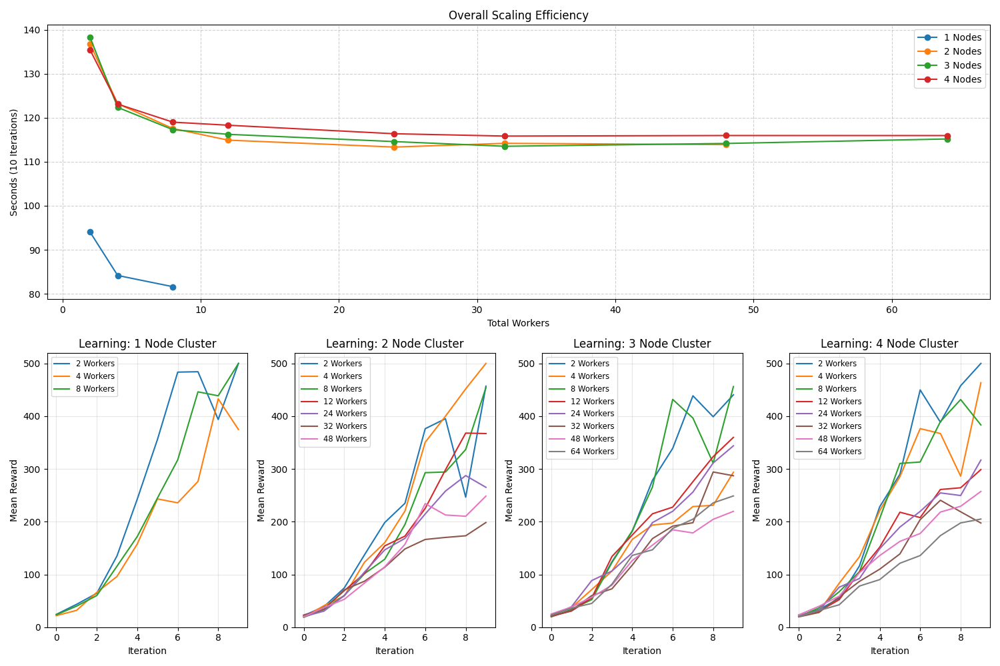

# Distributed PPO on Grid5000

This project runs distributed PPO training using Ray RLlib on the Grid5000 cluster.

## Structure
- src/: training scripts
- cluster/: Ray cluster setup
- results/: logs, plots, metrics

## How to run
Single node:
    python src/train.py

Multi node:
    python src/train2.py
# REPORT

## Section: Scaling Observations

Our results demonstrate **Amdahl's Law** in practice. While we increased the computational resources (nodes and workers), we observed a significant performance penalty when moving from a single-node to a multi-node configuration. The execution time for 2 workers increased by ~44% when moving to 2 nodes, representing the latency overhead of inter-node communication over the Grid'5000 fabric.

## Section: Efficiency Bottlenecks

The **CartPole-v1** environment is computationally "light." Consequently, the "worker coordination overhead" dominates the execution time. This is evident in the 3-node test, where increasing the worker count from 24 to 64 only resulted in a negligible change in execution time (~114s to ~115s). The system is bottlenecked by the Head node's ability to aggregate results rather than the workers' ability to simulate the environment.

## Section: Learning Performance

Higher worker counts did not lead to higher rewards within the 10-iteration window. In fact, the 1-node configuration achieved the maximum reward (500) more consistently. This suggests that for simple tasks like CartPole, a smaller, more "agile" worker configuration allows for more frequent policy updates, leading to faster convergence than large-scale distributed batches.

